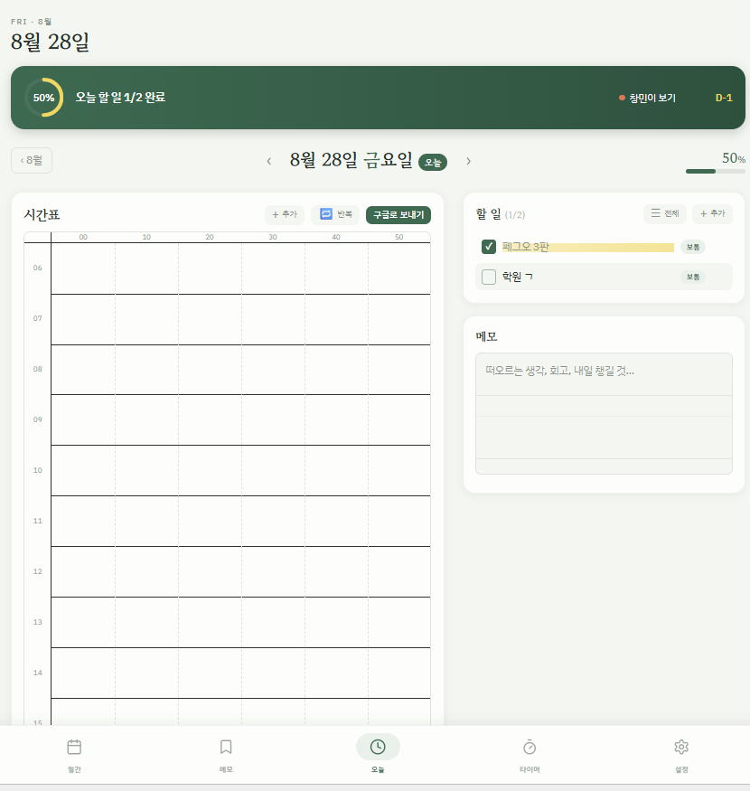
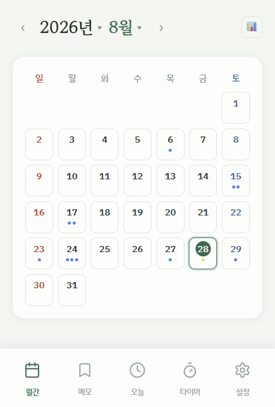
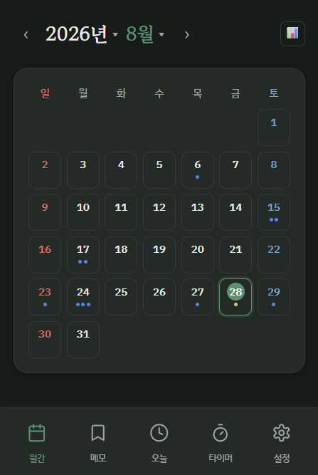
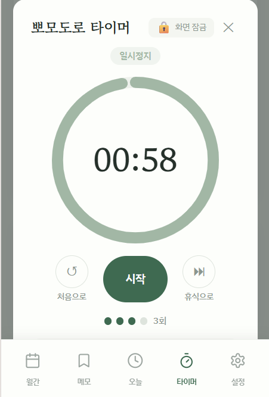

# 데일리 플래너

**구글 캘린더·할 일과 연동되는 개인용 데일리 플래너 웹앱**

연 → 월 → 일로 드릴다운하며 하루를 계획하고 기록하는 플래너입니다. 가로형 10분 단위 시간표, 구글 캘린더·할 일 양방향 연동, 뽀모도로 타이머, 습관 트래커, 통계 대시보드를 하나의 앱에 담았습니다. 백엔드 서버 없이 프론트엔드만으로 구글 API와 직접 통신합니다.

<p>
  <a href="https://daily-planner-xi-two.vercel.app">
    
  </a>
</p>

> **[👉 지금 바로 사용해보기](https://daily-planner-xi-two.vercel.app)**

---

## 📸 스크린샷

| 일간 뷰 | 월간 뷰 |
|:---:|:---:|
|  |  |

| 다크 모드 | 뽀모도로 타이머 |
|:---:|:---:|
|  |  |

---

## 🛠 기술 스택

| 구분 | 사용 기술 |
|---|---|
| **프레임워크** | React 18, TypeScript 5.5 |
| **빌드 도구** | Vite 5 |
| **스타일링** | Tailwind CSS v4 (`@tailwindcss/vite` 플러그인, 설정 파일 없이 CSS `@import`) + CSS 변수 기반 테마 |
| **차트** | Recharts 3 |
| **구글 연동** | Google Identity Services (GIS) 토큰 클라이언트, Google Calendar API v3, Google Tasks API v1 — **백엔드 없이 브라우저에서 직접 호출** |
| **선택적 클라우드 동기화** | Supabase REST (기기 간 데이터 이동용, 없어도 앱은 완전히 동작) |
| **배포** | Vercel (정적 SPA) |
| **PWA** | Web App Manifest + 홈 화면 설치, 전체화면 실행 |

의존성은 런타임 기준 `react`, `react-dom`, `recharts` 3개뿐입니다. 라우터·상태관리 라이브러리 없이 React 내장 훅과 상태 기반 뷰 전환만 사용했습니다.

---

## ✨ 핵심 기능

- **가로형 10분 단위 시간표** — 06:00~24:00을 시(hour) 행 × 10분 열 격자로 표현. 블록을 행 단위로 잘라 배치하고(`splitIntoRowSegments`), 시간대가 겹치는 일정끼리만 레인을 나눠 나란히 표시(`assignLanes`). 오늘 날짜에는 현재 시각 세로선을 그립니다.
- **시간표 드래그로 일정 추가** — 빈 시간대를 길게 눌러(롱프레스) 드래그하면 지나간 시간만큼 형광펜 미리보기가 그려지고, 손을 떼면 그 범위가 채워진 일정 추가 모달이 열립니다. 롱프레스로 선택 시작을 지연시켜 세로 스크롤과 구분하고, 선택 중에는 페이지 스크롤을 막습니다.
- **구글 자동 동기화 4종** — 백엔드 없이 브라우저에서 직접 Google API를 호출하며, 앱에서 만든 항목은 **추가하는 즉시 구글에 자동 반영**됩니다(D-Day·할 일은 항상 자동, 시간표는 설정 토글로 on/off).
  - **시간표 일정 → 구글 캘린더 (자동, 추가·삭제)** — 일정을 추가하면 구글 캘린더에 이벤트로 생성해 `googleEventId`를 블록에 연결하고, 시간표에서 삭제하면 구글 이벤트도 삭제합니다. 자동 동기화를 끄면 "구글로 보내기" 버튼으로 그날 일정을 한 번에 수동 전송. 반대로 구글의 일정(공휴일·구독 캘린더 포함)은 시간표 위에 함께 표시하고, 앱 일정·반복 일정·구글 일정의 겹침을 하나의 레이아웃 계산으로 통합 처리하며, 시간표에서 구글 일정을 바로 삭제할 수도 있습니다.
  - **할 일(Tasks) → 구글 할 일 (양방향)** — 앱에서 추가·완료·삭제·날짜(`due`) 변경한 내용을 구글 할 일에 반영하고, 구글에서 만들거나 바꾼 할 일(완료·삭제·날짜 이동 포함)을 로그인 시 앱으로 역동기화. `googleTaskId` + `notes` 마커의 2단 매칭으로 링크가 끊겨도 중복 생성을 막습니다.
  - **D-Day → 구글 캘린더 종일 이벤트 (자동 생성 + 역동기화)** — D-Day를 만들면 종일 이벤트로 자동 생성하고, 다른 기기에서 만든 D-Day도 로그인 시 가져옵니다.
  - **반복 일정 → 구글 캘린더 RRULE 반복 이벤트 (앱 → 구글)** — 앱의 요일 반복(월·수·금 등)을 `FREQ=WEEKLY;BYDAY=…` 반복 이벤트 하나로 변환해 등록.
- **D-Day** — D-7 이내 강조, 지난 D-Day 자동 숨김.
- **뽀모도로 타이머** — 종료 시각(`endTime`) 기준으로 남은 시간을 계산해 백그라운드 전환·새로고침 후에도 정확. 시간이 끝나면 자동 전환하지 않고 **완료 대기** 상태로 멈춰 소리/진동 알림을 반복하고, ① "확인"(반복 알림만 끔) → ② "휴식 시작 / 집중 시작"(다음 단계 전환 + 세션 카운트)의 2단계 확인을 거칩니다. 시간표 블록·구글 일정·반복 일정에서 ▶ 를 누르면 **그 일정 길이만큼** 집중 시간이 자동 설정됩니다(휴식 단계 없음). 오조작 방지용 화면 잠금 — 배경·닫기·컨트롤은 물론 하단 탭 전환까지 차단하고 "길게 눌러 해제"만 허용합니다.
- **습관 트래커** — 요일 지정 습관, 연속 달성 스트릭(적용되지 않는 요일은 건너뛰어 스트릭이 끊기지 않음), 월간 달성률.
- **통계 대시보드** — 월별 할 일 완료 추이, 습관 달성률, 시간대별 활용도, 집중 시간 요약(Recharts).
- **다크 모드** — CSS 변수만 재정의하는 방식. 첫 로드 시 깜빡임(FOUC) 없음.
- **반응형 · PWA** — 모바일(360px) 우선 설계, 하단 탭 바 내비게이션, 홈 화면 설치 지원.
- **데이터 백업** — `.ics` 캘린더 내보내기, JSON 백업/복원, 선택적 Supabase 동기화.

로컬 플래너 데이터(할 일·시간표·메모)는 `localStorage`에 날짜별로 저장하며, 내용이 비면 해당 날짜 키를 자동 삭제합니다.

---

## 🔍 기술적으로 고민한 점

### 1. 구글 캘린더 양방향 동기화 — "어떤 이벤트가 우리 앱 데이터인가"

**문제.** 앱에서 만든 시간표 블록·D-Day를 구글 캘린더에 저장한 뒤 다시 불러올 때, 수백 개의 구글 이벤트 중 어떤 것이 이 앱이 만든 것이고 어떤 로컬 데이터와 짝인지 식별해야 했습니다. 제목이나 시간으로 매칭하는 방식은 사용자가 구글에서 일정을 수정하면 바로 깨집니다.

**해결.** 이벤트 생성 시 `extendedProperties.private`에 커스텀 태그를 심었습니다.

```ts
extendedProperties: {
  private: { plannerId, plannerSource: "daily-planner" }, // 시간표 블록
  // D-Day는 plannerDDayId + plannerSource: "daily-planner-dday"
}
```

- 조회 시 `plannerSource`로 "앱이 만든 이벤트"를 걸러내고, `plannerId`로 로컬 블록과 1:1 매칭 → 중복 표시 방지.
- 단, **대응하는 로컬 블록이 실제로 있을 때만** 숨깁니다. 초기화됐거나 다른 기기라 로컬 원본이 없으면 그대로 표시해, 데이터가 사라진 것처럼 보이지 않게 했습니다.
- D-Day 역동기화는 `privateExtendedProperty=plannerSource=daily-planner-dday` 쿼리로 이 앱이 만든 종일 이벤트만 골라 가져온 뒤, `plannerDDayId`가 로컬에 없으면 추가합니다.
- 시간표 자동 동기화로 만든 이벤트는 생성 응답의 이벤트 id를 블록에 바로 저장해두고(`googleEventId`), 이후 삭제 등은 이 id로 직접 대응합니다. `plannerId` 태그 매칭은 링크가 없는 이벤트(수동 "구글로 보내기", 다른 기기)를 위한 폴백으로 남겨둡니다.

### 2. 구글 Tasks 양방향 동기화 — 커스텀 메타데이터가 없는 API에서 중복 방지

**문제.** 캘린더 이벤트에는 `extendedProperties.private`라는 커스텀 메타데이터 필드가 있어 "이 이벤트는 앱의 어떤 데이터"라고 표시할 수 있었지만(위 1번), **Tasks API에는 그런 필드가 없습니다.** 그래서 앱의 할 일과 구글 할 일을 어떻게 짝지을지가 문제였습니다. 특히 `localStorage`가 초기화되면 앱↔구글 링크가 끊겨, 역동기화 때 같은 할 일이 로컬에 다시 생성되는 중복이 발생합니다.

**해결.** 2단 매칭.

- **1차 — 링크 저장.** 앱에서 할 일을 만들 때 구글(`@default` 목록)에 생성하고, 받은 `googleTaskId`(+ 목록 id)를 로컬 할 일에 저장. 이후 동기화는 이 id로 1:1 매칭합니다.
- **2차 — notes 마커.** 생성 시 `notes` 필드에 `[[planner:<localId>]]` 마커도 함께 심습니다. 1차 링크가 유실돼도 역동기화에서 마커의 로컬 id로 기존 할 일을 찾아 **다시 연결**하고, 새로 만들지 않습니다.
- **반영 범위.** 추가·완료/완료취소·삭제·날짜(`due`) 변경까지 양방향. 충돌은 단일 사용자 가정 아래 **구글 상태를 기준**으로 일관 처리합니다 — 구글에서 완료면 로컬도 완료, 구글에서 사라졌으면 로컬도 삭제, `due`가 바뀌면 로컬 할 일을 그 날짜로 이동. 구글에서 새로 만든(미완료 + `due` 있음) 항목만 로컬로 편입하고, 완료 히스토리나 `due` 없는 항목은 편입하지 않습니다.
- **실패 처리.** 앱 → 구글 push는 액션 지점에서 즉시 시도하되 실패해도 로컬은 유지하고, 구글 → 앱 역동기화는 로그인 시 1회 실행합니다. 미로그인·tasks 스코프 없음이면 모든 동기화 헬퍼가 조용히 no-op(D-Day 연동과 동일한 graceful 처리).

### 3. 반복 일정 → 구글 캘린더 RRULE 반복 이벤트

**문제 1 — RRULE 생성.** 앱의 요일 반복(예: 월·수·금 09:00–10:00)을 구글 캘린더로 옮길 때, 낱개 이벤트를 여러 개 만들면 관리가 어려워 RRULE 반복 이벤트 하나로 만들기로 했습니다.

**해결 1.** 앱의 `days`(0=일~6=토)를 `BYDAY` 코드로 변환해 `RRULE:FREQ=WEEKLY;BYDAY=MO,WE,FR` 형태로 생성. 종료일이 있으면 `UNTIL`을 붙이는데, **DTSTART가 타임존이 있는 `dateTime`이면 `UNTIL`은 RFC 5545 규칙상 UTC(`YYYYMMDDTHHMMSSZ`) 형식이어야 합니다.** 종료일 당일이 마지막 반복에 포함되도록 그 날 23:59:59(로컬)를 UTC로 변환해 넣었습니다.

**문제 2 — 조회 시 중복 표시.** 구글 이벤트를 가져올 때 `singleEvents=true` 옵션을 쓰는데(그래야 각 일정이 실제 발생 시각을 가진 인스턴스로 와서 시간표에 배치할 수 있음), 이 옵션은 반복 이벤트를 **날짜별 개별 인스턴스로 펼쳐서** 반환합니다. 그러면 앱이 로컬에서 그리는 반복 블록과 구글에서 펼쳐져 온 인스턴스가 같은 자리에 겹쳐 두 번 보입니다.

**해결 2.** 앱이 만든 반복 이벤트에 `plannerSource: "daily-planner-recurring"` + `plannerRecurringId` 태그를 심고, 조회 결과에서 **로컬에 대응하는 반복 일정이 살아 있으면** 그 인스턴스를 필터링합니다(1번의 시간표 블록과 같은 원리). 로컬 원본이 없으면(다른 기기 등) 그대로 표시합니다. 펼쳐진 인스턴스는 "이 날만 / 전체" 삭제 구분이 애매해 개별 삭제 버튼을 달지 않고, "반복" 관리 모달에서 통째로 삭제하도록 안내합니다.

### 4. 여러 캘린더 동시 조회 + 종일 일정의 타임존 경계

**문제.** `calendar.events` 스코프만으로는 캘린더 **목록**(공휴일, 구독 캘린더 등)을 읽을 수 없어 기본 캘린더의 일정만 보였습니다. 또 종일 일정은 구글 서버가 `timeMin`/`timeMax` 겹침 판정을 어느 타임존 기준으로 하는지 불명확해, 날짜 경계의 일정이 누락되거나 하루 밀려 보였습니다.

**해결.**
- `calendar.calendarlist.readonly` 스코프를 추가해 접근 가능한 모든 캘린더를 조회하고, 각 캘린더의 이벤트를 `Promise.all`로 병렬 요청해 병합. 캘린더마다 이벤트 `id`가 겹칠 수 있어 `calendarId:eventId` 조합 키(`eventUid`)로 React key 충돌을 방지했습니다.
- 서버에는 앞뒤로 하루씩 여유를 둔 넓은 범위를 요청하고, **실제로 그 날짜를 포함하는지는 클라이언트에서 다시 정확히 판정**(`eventCoversDate`). 구글 종일 일정의 `end.date`가 배타적 경계(다음 날)로 온다는 점도 여기서 처리합니다.

### 5. 백엔드 없이 프론트엔드만으로 구글 API 사용 + 점진적 권한 확장

**문제.** 개인용 앱에 서버를 두고 싶지 않았지만, OAuth 리다이렉트 방식은 콜백을 받을 백엔드가 필요합니다. 또 개발을 진행하며 스코프(캘린더 → 캘린더+할 일)를 늘렸는데, 이전에 로그인한 사용자의 토큰에는 새 스코프가 없어 할 일 API가 403을 반환했습니다.

**해결.**
- **GIS 토큰 클라이언트**(`initTokenClient`)로 브라우저에서 직접 액세스 토큰을 발급받아 REST API를 호출. 토큰은 `expires_at`과 함께 `localStorage`에 저장하고, 만료 1분 전이면 무효로 간주. 401 응답 시 토큰을 지우고 "다시 연결" UX로 유도합니다.
- GIS가 **실제로 부여한 스코프 문자열**을 토큰과 함께 저장해두고, 할 일 API 호출 전에 `hasTasksScope()`로 확인. 스코프가 없으면 요청을 아예 보내지 않고 조용히 빈 목록을 반환 → **캘린더 기능은 그대로 두고 할 일 기능만 비활성화**. 재로그인하면 새 동의 화면이 뜨고 정상 동작합니다.
- 할 일 API가 403/401을 반환해도 캘린더 스코프가 함께 담긴 토큰은 지우지 않아, 할 일 문제로 캘린더 연결까지 끊기지 않도록 했습니다.

### 6. CSS 변수 기반 다크 모드 — 200곳 넘는 인라인 스타일을 한 번에 전환

**문제.** 컴포넌트 곳곳에서 `style={{ color: "#22302A" }}`처럼 색을 인라인으로 쓰고 있었는데, 다크 모드를 위해 이걸 전부 조건부로 바꾸는 건 비현실적이었습니다.

**해결.**
- 모든 색을 `index.css`의 CSS 변수(`:root`)로 정의하고, 다크 테마는 `html.dark`에서 **변수 값만 재정의**. 컴포넌트는 색 리터럴 대신 `P.ink`(`= "var(--ink)"`) 같은 변수 참조만 사용하므로, `<html>`에 `.dark` 클래스를 토글하는 것만으로 인라인 스타일까지 전부 테마를 따라갑니다.
- **FOUC 방지**: 번들이 로드되기 전 `index.html`의 blocking `<script>`에서 `localStorage`를 읽어 `<html>`에 `.dark`를 먼저 붙입니다. React가 마운트되기 전에 배경색이 확정돼 흰 화면 깜빡임이 없습니다.
- Recharts처럼 SVG 속성으로 색을 받는 곳은 `color-mix()` 호환 이슈가 있어 반투명 색을 `rgba()` 변수로 따로 정의했습니다.

### 7. 뽀모도로 타이머 — 백그라운드 정확도와 "놓치지 않는" 알림

**문제.** `setInterval`로 남은 시간을 1초씩 빼면 탭이 백그라운드로 가는 순간 타이머가 스로틀되어 몇 분씩 어긋납니다. 또 세션이 끝나자마자 다음 단계로 자동 전환되면, 자리를 비운 사이 알림을 놓치고 휴식이 이미 끝나 있는 일이 생겼습니다.

**해결.**
- 상태로 남은 시간을 들고 있지 않고, **종료 시각 `endTime`(epoch ms)만 저장**한 뒤 매 렌더에서 `endTime - Date.now()`로 재계산. `setInterval`은 화면 갱신 용도로만 쓰고, `visibilitychange`로 탭 복귀 시 즉시 재계산합니다. 새로고침·백그라운드 전환 후에도 정확합니다.
- 시간이 0이 되면 자동 전환 대신 **"완료 대기(awaiting)"** 상태로 멈추고, 확인 전까지 소리/진동 알림을 반복(`setInterval`). 확인은 2단계로 분리 — ① "확인"으로 반복 알림만 끄고, ② "휴식 시작"으로 실제 다음 단계 전환 + 세션 카운트 반영.
- `setInterval` 틱과 `visibilitychange`가 연달아 발생해 같은 만료를 두 번 처리하는 걸 막기 위해 마지막 처리한 `endTime`을 기억(`handledEndTimeRef`). 세션 카운트 증가 같은 부수효과는 `setState` 업데이터 밖에서 처리해 StrictMode 이중 실행으로 인한 중복 집계를 피했습니다.
- **일정 길이 타이머.** 시간표 블록·구글 일정·반복 일정에서 ▶ 로 열면 그 일정의 길이(`end - start`)를 `customFocusMs`로 넘겨받아 설정값 대신 사용하고, `noBreak` 플래그로 휴식 단계를 건너뜁니다. 자동 시작하지 않고 대기(idle) 상태로 열어 사용자가 시작을 누르게 했습니다.
- **오조작 방지 화면 잠금.** 잠금 중에는 모달 배경 클릭·✕·컨트롤 버튼을 모두 막고, 상위(App)에 잠금 상태를 전파해 **하단 탭바 전환까지** 차단합니다. 해제는 "길게 눌러 해제"(1.5초 홀드)만 유효. 단 완료 알림을 끄는 "확인"은 잠금 중에도 항상 눌리도록 예외로 뒀습니다.

### 8. 시간표 드래그로 일정 추가 — 스크롤과 구분되는 터치 제스처

**문제.** 가로형 10분 격자에서 "빈 시간대를 드래그해 그만큼 일정 만들기"를 넣으려는데, 모바일에서는 같은 손동작이 세로 스크롤이기도 합니다. 게다가 React 합성 이벤트로는 `touchmove`의 기본 스크롤을 막을 수 없습니다(합성 이벤트에 붙는 리스너가 passive라 `preventDefault`가 무시됨).

**해결.**
- **롱프레스로 의도 분리.** `touchstart` 후 300ms 안에 손가락이 8px 이상 움직이면 스크롤로 보고 타이머를 취소해 스크롤에 양보하고, 움직임 없이 300ms를 넘겨야 선택 모드로 진입합니다(진입 시 짧은 진동으로 피드백). 마우스는 롱프레스 없이 6px 이상 끌면 바로 시작.
- **좌표 → 시각 변환.** 터치 좌표를 격자 `getBoundingClientRect` 기준으로 (세로 = 시(hour) 행, 가로 = 그 시간 내 0~60분) 분으로 환산하고, 앵커~현재 지점을 10분 격자에 스냅(`normalizeSel` — 최소 10분, 타임라인 범위 06:00~24:00으로 clamp)해 형광펜으로 미리 그립니다.
- **네이티브 리스너 + `preventDefault`.** `touchmove`를 `{ passive: false }`로 직접 등록해, 선택 중에만 `e.preventDefault()`로 페이지 스크롤을 차단합니다.
- **빈 영역에서만 시작.** 시작 지점이 이미 앱 블록·반복·구글 일정에 점유돼 있으면 드래그를 시작하지 않습니다. 점유 판정 함수를 매 렌더 `ref`로 갱신해, effect 안에 한 번 등록된 네이티브 리스너에서도 최신 데이터를 참조하게 했습니다.
- 손을 떼면 확정 범위를 `TimeBlockFormModal`에 `fixedStart`/`fixedEnd`로 넘겨, 시간 select 대신 읽기 전용 텍스트로 고정한 채 제목·색만 입력받습니다.

### 9. 디자인 우선 워크플로우

기능부터 구현하지 않고 **Figma에서 전체 화면을 먼저 설계**했습니다. 색·타이포·간격의 디자인 시스템을 정의하고, 주요 화면 시안과 화면 전환 흐름도를 그린 뒤, 그 시안을 기준으로 컴포넌트를 하나씩 구현했습니다. CSS 변수 팔레트(`--paper`, `--ink`, `--green` …)와 공통 `.card` 스타일이 이 디자인 시스템을 그대로 코드로 옮긴 결과이고, 덕분에 다크 모드 대응과 화면 간 디자인 통일이 수월했습니다.

---

## 🚀 실행 방법

```bash
git clone <이 저장소 URL>
cd daily-planner
npm install

# 구글 연동을 쓰려면 .env 파일 생성 후 클라이언트 ID 설정
cp .env.example .env
# .env 안의 VITE_GOOGLE_CLIENT_ID 값을 본인 것으로 교체

npm run dev        # http://localhost:5173
```

빌드 / 미리보기:

```bash
npm run build      # tsc -b && vite build → dist/
npm run preview
```

### 구글 연동 설정 (선택)

구글 캘린더·할 일 연동 없이도 앱의 모든 기능(시간표, 할 일, 메모, 습관, 타이머, 통계, ICS·JSON 백업)은 정상 동작합니다. 연동을 쓰려면:

1. [Google Cloud Console](https://console.cloud.google.com)에서 프로젝트 생성
2. **Google Calendar API**, **Google Tasks API** 활성화
3. **OAuth 2.0 클라이언트 ID**(웹 애플리케이션) 생성 → 승인된 JavaScript 원본에 `http://localhost:5173`(및 배포 도메인) 추가
4. 발급받은 클라이언트 ID를 `.env`의 `VITE_GOOGLE_CLIENT_ID`에 설정

토큰은 브라우저(`localStorage`)에만 저장되며 서버로 전송되지 않습니다.

---

## 📁 프로젝트 구조

```
daily-planner/
├── index.html                 FOUC 방지 blocking 스크립트 + 폰트 로드
├── vite.config.ts             React + Tailwind v4 플러그인
├── public/
│   ├── manifest.webmanifest   PWA 매니페스트
│   └── icon.svg
└── src/
    ├── main.tsx               엔트리
    ├── App.tsx                뷰 전환(연/월/일/통계/메모/설정) + 상단 요약카드 + D-Day·할 일 역동기화
    ├── index.css              CSS 변수 팔레트(라이트/다크), 공통 .card, 애니메이션
    ├── lib.ts                 타입 · 날짜/시간 유틸 · localStorage · 겹침 레인 배치(assignLanes)
    │                          · ICS 생성 · 습관/D-Day/통계 집계 · 구글 Tasks 매칭·편입(reconcileGoogleTasks)
    │                          · 시간표 자동 동기화 설정 · Supabase 동기화 · 테마 팔레트(P)
    ├── gcal.ts                구글 캘린더 연동 (GIS 토큰, 다중 캘린더 병합, 시간표 이벤트 생성/수정/삭제,
    │                          D-Day 종일 이벤트, 반복 일정 RRULE)
    ├── gtasks.ts              구글 할 일(Tasks) REST 호출 (스코프 감지, 조회/생성/완료/삭제, 역동기화용 전체 스냅샷)
    ├── taskSync.ts            할 일 ↔ 구글 Tasks 양방향 동기화 헬퍼 (앱→구글 push + 로그인 시 역동기화)
    ├── pomodoro.ts            뽀모도로 상태 머신 (endTime 기준, awaiting 2단계 확인, 일정 길이 타이머, usePomodoro 훅)
    └── views/
        ├── DayView.tsx        가로 시간표 격자 + 할 일 + 메모 + 오늘의 습관 (자동 저장, 드래그로 일정 추가,
        │                      시간표 구글 자동 동기화, 구글/반복 일정 타이머·삭제)
        ├── MonthView.tsx      월간 캘린더 (데이터/구글 일정/습관 달성 표시, 2단계 클릭)
        ├── YearView.tsx       12개월 미니 캘린더 그리드
        ├── YearPickerView.tsx 연도 선택
        ├── StatsView.tsx      통계 대시보드 (Recharts)
        ├── MemoView.tsx       메모 모아보기
        ├── TimerModal.tsx     뽀모도로 타이머 UI (진행 링, 2단계 확인, 화면 잠금)
        ├── TodosModal.tsx     전체 할 일 (로컬 + 구글, 필터)
        ├── ConfirmModal.tsx   앱 스타일 확인 모달 (구글 일정 삭제 등)
        ├── DDayModal.tsx      / DDayFormModal.tsx   D-Day 관리
        ├── HabitModal.tsx     습관 관리
        ├── RecurringModal.tsx 매주 반복되는 고정 일정 관리 (구글 캘린더 RRULE 이벤트 등록/삭제)
        ├── SettingsView.tsx   / SettingsModal.tsx  구글 연결 · 시간표 자동 동기화 토글 · 알림 · 다크모드 · 백업
        ├── BottomTabBar.tsx   하단 탭 내비게이션
        ├── MiniCalendar.tsx   · TimeBlockFormModal.tsx · TaskFormModal.tsx · GhostButton.tsx
```
